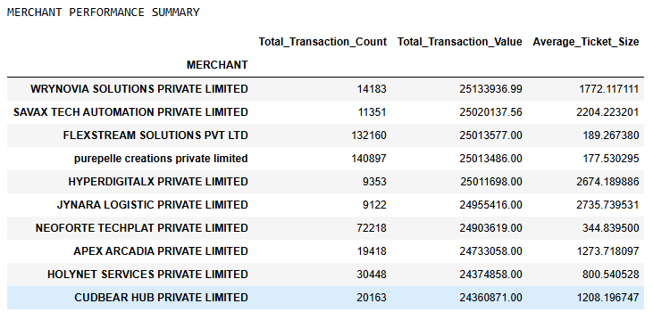
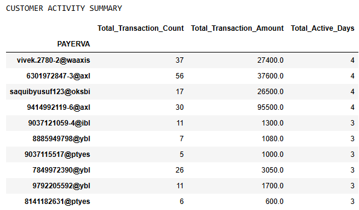
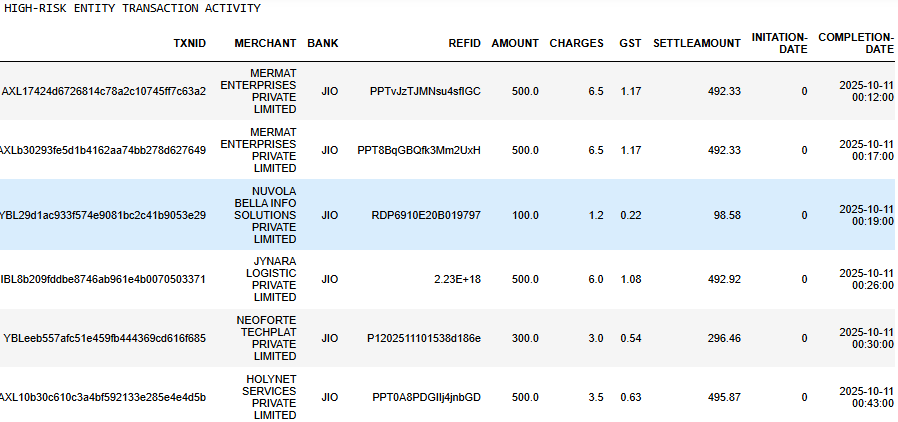

# 🚀 Automated Transaction Risk Monitoring & Analytics System
## 📌 Overview
This project is a **Python-based transaction analytics and risk monitoring system** that automates the consolidation, analysis, and monitoring of transaction datasets.<br>

It processes multiple transaction files, generates merchant and customer insights, and identifies transactions associated with high-risk entities for monitoring and investigation.<br>

This project demonstrates practical applications of data automation, transaction intelligence, and risk analytics using Python.

## ✨ Features
**📂 1. Multi-File Transaction Consolidation**<br>
Automatically reads and combines multiple CSV transaction files into a unified dataset.<br>

**📊 2. Merchant Performance Analysis**<br>
Generates merchant-level metrics such as:<br>
&nbsp;&nbsp;&nbsp;&nbsp;• Total transaction count<br>
&nbsp;&nbsp;&nbsp;&nbsp;• Total transaction value<br>
&nbsp;&nbsp;&nbsp;&nbsp;• Average ticket size<br>

**👤 3. Customer Activity Analysis**<br>
Tracks customer behavior using:<br>
&nbsp;&nbsp;&nbsp;&nbsp;• Transaction frequency<br>
&nbsp;&nbsp;&nbsp;&nbsp;• Total transaction value<br>
&nbsp;&nbsp;&nbsp;&nbsp;• Active transaction days<br>

**🕒 4. Temporal Data Processing**<br>
Converts transaction timestamps into structured date fields for analysis.

**⚠️ 5. High-Risk Entity Monitoring**
Matches transactions against a predefined high-risk reference list.

**📈 6. Automated Reporting Output**
Displays analytical summaries for operational review.

## 🛠️ Tech Stack
&nbsp;&nbsp;&nbsp;&nbsp;• 🐍 Python<br>
&nbsp;&nbsp;&nbsp;&nbsp;• 🐼 Pandas<br>
&nbsp;&nbsp;&nbsp;&nbsp;• 📁 OS Module

## 📁 Project Structure
```
automated-transaction-risk-monitoring/
│
├── transaction_risk_monitoring.py
├── VPAs.xlsx
├── transaction_files/
└── README.md
```

## ⚙️ How It Works
1️⃣ Data Ingestion<br>
&nbsp;&nbsp;&nbsp;&nbsp;Loads all transaction CSV files from the source directory.<br>

2️⃣ Data Consolidation<br>
&nbsp;&nbsp;&nbsp;&nbsp;Combines all transaction files into a master dataframe.<br>

3️⃣ Merchant Analysis<br>
&nbsp;&nbsp;&nbsp;&nbsp;Calculates merchant transaction metrics.<br>

4️⃣ Customer Analysis<br>
&nbsp;&nbsp;&nbsp;&nbsp;Measures customer activity patterns.<br>

5️⃣ Risk Entity Matching<br>
&nbsp;&nbsp;&nbsp;&nbsp;Flags transactions involving monitored high-risk entities.<br>

6️⃣ Reporting<br>
&nbsp;&nbsp;&nbsp;&nbsp;Displays summarized analytical outputs.<br>

## 📸 Sample Output
**📊 Merchant Performance Summary**<br>


**👤 Customer Activity Summary**<br>


**🚨 High-Risk Entity Transaction Activity**


## 🎯 Key Learning Outcomes
This project strengthened my understanding of:<br>
&nbsp;&nbsp;&nbsp;&nbsp;• Data ingestion pipelines<br>
&nbsp;&nbsp;&nbsp;&nbsp;• Transaction analytics<br>
&nbsp;&nbsp;&nbsp;&nbsp;• Risk monitoring workflows<br>
&nbsp;&nbsp;&nbsp;&nbsp;• Data aggregation with Pandas<br>
&nbsp;&nbsp;&nbsp;&nbsp;• Temporal data transformation<br>
&nbsp;&nbsp;&nbsp;&nbsp;• Automated analytical reporting

## 🌍 Real-World Applications
&nbsp;&nbsp;&nbsp;&nbsp;• This system can support:<br>
&nbsp;&nbsp;&nbsp;&nbsp;• Fraud detection workflows<br>
&nbsp;&nbsp;&nbsp;&nbsp;• Transaction monitoring<br>
&nbsp;&nbsp;&nbsp;&nbsp;• Risk analytics<br>
&nbsp;&nbsp;&nbsp;&nbsp;• Compliance operations<br>
&nbsp;&nbsp;&nbsp;&nbsp;• Financial data intelligence

View notebook with detailed steps here: [Automated Transaction Risk Monitoring & Analytics System](PYTHON_AUTOMATED_TRANSACTION_RISK_MONITORING_-_ANALYTICS_SYSTEM.ipynb)
